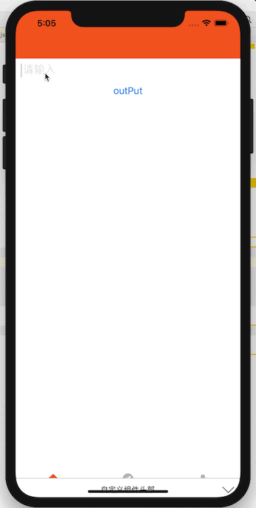

# react-native-supervons-custom-keyboard
[English](/README.md "english readme")  简体中文

# github 地址（欢迎关注━(*｀∀´*)ノ亻!）
https://github.com/supervons/react-native-supervons-custom-keyboard

## 综述
```
基于 react-native-security-keyboard 开发，增加：
1. 大小写字母
2. 字符
3. 按键响应
4. 切换键盘类型
5. 随机排列键盘

感谢 yanzhandong 的开源分享
```
## 预览

## 开始

`$ npm install react-native-supervons-custom-keyboard --save`


## 示例
```js
import React, { Component } from 'react';
import { View, Button } from 'react-native';
import RNSVCustomKeyboard from 'react-native-supervons-custom-keyboard';
```
```jsx
export default class MainPage extends Component {
  constructor(props) {
    super(props);
    this.state = {
      inputValue: ''
    };
  }

  render() {
    return (
      <View style={{ flex: 1, backgroundColor: '#ffffff' }}>
        <View style={{ height: 150 }}>
          <RNSVCustomKeyboard
            style={{ width: width * 0.96, borderBottomColor: '#939DA6', borderBottomWidth: 1 }}
            secureTextEntry={true}
            random={true}
            valueStyle={{ fontSize: 18, left: 1 }}
            secureTextStyle={{ fontSize: 10 }}
            keyboardType={'string'}
            placeholder={'密码'}
            placeholderTextColor={'#CACACB'}
            onChangeText={text => this.setState({ inputValue: text })}
          />
          <Button title={'outPut'} onPress={() => alert(this.state.inputValue)} />
        </View>
      </View>
    );
  }
}
```
### 属性

| **属性** | **类型** | **简述** |
|----------|----------|-----------------|
| `disabled` | `Boolean` | 禁止输入，默认false |
| `random` | `Boolean` | 键盘字母、数字随机布局，默认false |
| `caretHidden` | `Boolean` | 是否隐藏光标，默认false|
| `secureTextEntry` | `Boolean` | 密码模式，默认false |
| `placeholderTextColor` | `String` | 占位符字符串显示的文本颜色 |
| `style` | `Object` | 自定义TextInput外部样式Style，不支持字体样式 |
| `valueStyle` | `Object` | 字体样式|
| `keyboardHeader` | `element` | 头部元素|
| `regs` | `Func(value)` | 值校验 |
| `onChangeText` | `Func(value)` | 输入值改变回调方法. |
| `onFocus` | `Func` | 获得焦点回调方法. |
| `onBlur` | `Func` | 失去焦点回调方法 |

### 方法

| **方法名** | **参数** | **简述** |
|------------|---------------|-----------------|
| `clear` | none | 清除文本内容 |
| `isFocused` | none | 判断当前输入框是否获得焦点 |
| `blur` | none | 失去焦点. |
| `focus` | none | 获得焦点. |

  